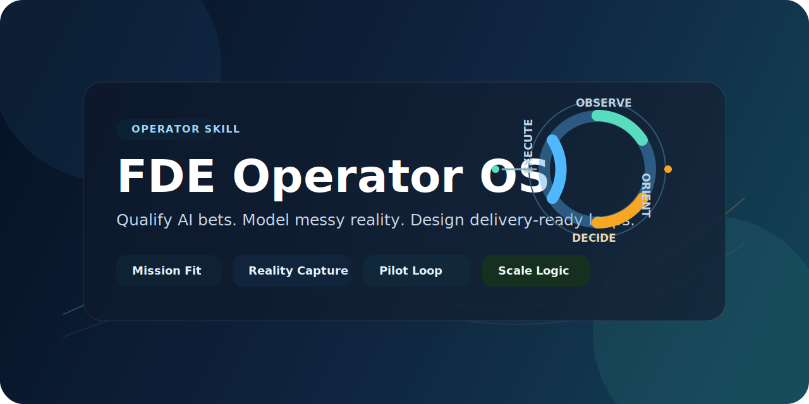

<div align="center">

# Applied AI Operator OS

`fde-operator-os` for forward deployed and applied AI delivery work

[English](#english) | [中文](#中文)



</div>

<a id="english"></a>

## English

An operator-grade Applied AI operator skill and reusable playbook for forward deployed engineers, applied AI leads, and delivery owners who need to turn messy customer problems into delivery-worthy AI operating loops and reusable assets.

### What It Is

`fde-operator-os` is a general-purpose Applied AI operator skill for:

- qualifying whether an AI opportunity is worth pursuing
- modeling operational reality instead of idealized process maps
- framing the real system bottleneck
- designing business objects, state transitions, action surfaces, and human-in-the-loop boundaries
- compressing a broad idea into a minimum viable loop
- defining a delivery-ready path from pilot to expansion

It is intentionally cross-industry. Domain cases should stay outside the core skill unless you choose to maintain a separate case pack.

It should not be read as "send an engineer on site." In this repository, FDE means the operating role that turns field ambiguity into reusable delivery and product capability.

### Who It Is For

This skill is written for:

- Forward Deployed Engineers
- Applied AI Engineers
- AI delivery leads
- solution architects working on operational AI systems
- founders or early delivery teams doing customer-specific AI implementations

It is not optimized for:

- pure prompt tinkering
- generic AI workshops
- one-off coding tasks with no delivery framing

### When To Use It

Use this repository when you are still doing upstream FDE work such as:

- deciding whether an AI opportunity is worth pursuing
- compressing a messy customer situation into one delivery-worthy loop
- defining operator, trigger, object, output, and acceptance before build
- designing pilot boundaries, human-in-the-loop control, and evidence flow
- preventing a project from drifting into AI theater, pilot bloat, or free-form solutioning

In short:

> Use it when you do **not** yet have a trustworthy operator loop, but need one.

### When Not To Use It First

Do not reach for this repository first when:

- the loop is already defined and the team just needs to implement
- the task is only note-taking, minutes, or transcript cleanup
- the work is only vendor comparison or product selection
- the request is only coding, debugging, or build execution

In short:

> If the problem is already framed and only execution remains, this is no longer the main tool.

### First-Time Use

The most common mistake is to use this repository to analyze an entire account, project, or sales motion on the first run.

Do this instead:

1. pick **one operator**
2. pick **one trigger**
3. pick **one business object**
4. pick **one output**
5. run the skill on that bounded loop before expanding outward

Recommended first-run stopping point:

- Mission Brief
- Operational Reality Map
- System Problem Frame
- State, Action & Evidence Model
- AI Intervention Design
- Minimum Viable Loop
- POC Acceptance Contract

Do **not** force Delivery Architecture or Expansion Logic on the first run if operational evidence is still thin.

### 60-Second Quickstart

Example prompt:

```text
Use $fde-operator-os.

Do not analyze the whole project.
Run one bounded loop only:

- Scenario: warehouse exception closure
- Operator: floor supervisor
- Trigger: exception alert arrives
- Output: confirmed closure task with audit record

Produce the core operator artifacts up to POC Acceptance Contract.
```

### How It Helps FDE Work

This repository is most useful when an FDE needs help doing five things well:

1. determine whether an opportunity has enough operational density to justify delivery
2. reconstruct real work instead of repeating narrated process
3. narrow the system to the right bottleneck
4. turn business ambiguity into objects, states, actions, permissions, and evidence
5. define a pilot that can actually be judged, not just demoed

That is why the main value is not "better brainstorming." The main value is **better loop definition**.

### Core Model

The skill runs a seven-stage decision chain:

1. Mission Qualification
2. Operational Reality Capture
3. System Framing
4. State, Action & Evidence Model
5. Intervention & Pilot Design
6. Delivery Architecture
7. Expansion Logic

The seven stages are followed by a post-delivery asset distillation overlay so project learning does not die inside one customer engagement.

It ships with eight core operator artifacts plus one closeout artifact:

- Mission Brief
- Operational Reality Map
- System Problem Frame
- State, Action & Evidence Model
- AI Intervention Design
- Minimum Viable Loop
- POC Acceptance Contract
- Expansion Roadmap
- Asset Distillation Log

### Positioning

This repository is best understood as an Applied AI Operator OS.

- FDE is the audience and operating context.
- Operator OS is the actual product shape.
- The goal is not to explain the FDE title. The goal is to help an operator qualify, frame, deliver, and distill an AI loop.

The important modeling primitive is not the word "ontology." It is the ability to define business objects, state changes, actions, permissions, and evidence clearly enough that a system can run and be trusted.

### FAQ

**If I am an FDE, can I just follow this repository step by step?**

Yes, as a default structure. No, as a substitute for judgment.

This repository is designed to reduce structural mistakes: jumping into solutioning too early, skipping ownership, missing fallback paths, or defining a pilot with no acceptance contract. If you follow the stages and artifacts, you will usually start in the right place and produce more decision-ready outputs.

What it does **not** replace is the hard part of real FDE work:

- reading the customer organization correctly
- spotting shadow workflows and exception paths
- modeling the domain accurately enough to matter
- judging what is politically possible now versus later
- deciding which problem is worth solving first

Treat this repository as scaffolding for FDE judgment, not as autopilot.

The value of the work is not only that one customer loop ships. The higher bar is that one customer loop makes the next loop easier to qualify, deliver, test, or productize.

### Example Output

See [`examples/synthetic-exception-closure-ai/`](./examples/synthetic-exception-closure-ai/) for a small synthetic case showing both delivery artifacts and post-project asset distillation outputs.

Use [`examples/case-pack-template/`](./examples/case-pack-template/) when you want a reusable layout for future domain cases.

Use [`examples/first-run-minimal-loop/`](./examples/first-run-minimal-loop/) when you want to see how a first-time user should narrow scope and stop at the right point.

### Repository Layout

```text
fde-operator-os/
├── aliases/
│   └── fde/
│       ├── SKILL.md
│       └── agents/
│           └── openai.yaml
├── SKILL.md
├── README.md
├── LICENSE
├── examples/
│   ├── case-pack-template/
│   │   └── README.md
│   ├── first-run-minimal-loop/
│   │   └── README.md
│   └── synthetic-exception-closure-ai/
│       ├── input-notes.md
│       ├── 01-mission-brief.md
│       ├── 02-operational-reality-map.md
│       ├── 03-system-problem-frame.md
│       ├── 04-minimum-viable-loop.md
│       ├── 05-poc-acceptance-contract.md
│       ├── 06-reusable-patterns.md
│       ├── 07-eval-cases.md
│       ├── 08-product-feedback.md
│       └── 09-asset-distillation-log.md
├── agents/
│   └── openai.yaml
├── references/
│   ├── doctrine.md
│   ├── asset-distillation-loop.md
│   ├── operator-heuristics.md
│   ├── failure-patterns.md
│   └── runtime-portability.md
└── assets/
    ├── readme/
    │   ├── banner-en.svg
    │   └── banner-zh.svg
    └── templates/
        ├── mission-brief.md
        ├── operational-reality-map.md
        ├── system-problem-frame.md
        ├── ontology-action-model.md
        ├── ai-intervention-design.md
        ├── minimum-viable-loop.md
        ├── poc-acceptance-contract.md
        ├── expansion-roadmap.md
        └── asset-distillation-log.md
```

### Asset Distillation Loop

The repository now makes the delivery-to-asset transition explicit.

After a loop is qualified, framed, piloted, and made delivery-ready, close the case by distilling reusable assets such as:

- problem patterns
- workflow templates
- data-readiness checklists
- eval or test-case packs
- governance checklists
- SOPs, skills, and internal tools
- product backlog items

Promotion rule:

> A project lesson is not an asset until another operator can reuse it without the original project context.

### Install

You can use this repository in two ways:

1. As a Codex-style skill by copying the folder into your local skills directory.
2. As a portable Applied AI delivery playbook by adapting the doctrine, references, and templates to your own agent or delivery workflow.
3. As a host-neutral skill pack for OpenClaw, Hermes, Claude Code, or other runtimes that can reuse prompt packs, templates, and references.

Example Codex-style install:

```powershell
Copy-Item -Recurse .\fde-operator-os "$HOME\.codex\skills\"
```

Then use prompts like:

- `Use $fde-operator-os to decide whether this AI opportunity is worth pursuing.`
- `Use $fde-operator-os to turn this workflow into a minimum viable loop.`
- `Use $fde-operator-os to define the operator artifacts for this pilot.`

Optional short alias for hosts that support wrappers:

- copy `aliases/fde/` into your host's skill root as `fde`
- invoke with `$fde` or map `/FDE` in hosts that support slash aliases

See [`references/runtime-portability.md`](./references/runtime-portability.md) for host-neutral guidance across Codex, OpenClaw, Hermes, and Claude Code.

### Design Principles

- Qualify before designing.
- Model the real operating system, not the narrated one.
- Solve for closed-loop outcomes, not feature demos.
- Keep AI on the narrowest surface that creates measurable value.
- Treat ownership, trust, and auditability as design constraints.
- Make every credible delivery leave reusable assets behind.

### Validation

This skill is compatible with standard skill validation flows and has been validated during development with a standard `quick_validate.py` check.

### Status

This skill is actively being refined through ongoing Applied AI delivery work. The core doctrine and artifact set are stable enough to use, but the playbook will continue to evolve as more real-world delivery patterns, failure cases, operator judgments, and reusable assets are distilled into the repository.

### License

MIT

---

<a id="中文"></a>

## 中文

这是一个面向 Forward Deployed Engineer、Applied AI 交付负责人和方案架构角色的通用 Applied AI Operator skill / playbook，用来把混乱的客户问题推进成可交付、可验证、可扩展，并且可沉淀资产的 AI 运营闭环。

### 它解决什么问题

`fde-operator-os` 适合用来：

- 判断一个 AI 机会到底值不值得做
- 把真实业务现场而不是理想流程结构化出来
- 找到真正的系统瓶颈，而不是堆功能清单
- 设计业务对象、状态流转、action surface 和人机边界
- 把宽泛想法压缩成一个最小可验证闭环
- 定义从 pilot 到规模化扩展的交付路径

它默认是跨行业的。领域案例建议留在 skill 外部，按你自己的私有项目或独立 case pack 来验证。

这里的 FDE 不应理解成“派工程师去现场”。在这个仓库里，FDE 更准确的含义是：把一线不确定性压缩成可复用交付能力和产品资产的操盘角色。

### 它更适合谁

- FDE / 前线部署工程师
- Applied AI 工程师
- AI 交付负责人
- 负责运营型 AI 系统的方案架构师
- 做客户定制 AI 落地的创始团队或早期交付团队

它不适合：

- 纯 prompt 调优
- 泛 AI 培训工作坊
- 没有交付 framing 的一次性编码任务

### 什么时候用

当你还在做 FDE 上游工作时，这个仓库最有用，比如：

- 判断一个 AI 机会值不值得做
- 把混乱业务机会压缩成一个可交付 loop
- 在开发前先定义 operator、trigger、object、output 和 acceptance
- 定义 pilot 边界、人机协同边界和证据流
- 防止项目滑向 AI theater、pilot bloat 或泛化方案堆叠

一句话：

> 当你还没有一个可信的 operator loop，但需要尽快压出一个时，用它。

### 什么时候不要先用

下面这些情况，不要先拿它当主工具：

- loop 已经定义清楚，只剩编码实现
- 只是整理会议纪要或转写
- 只是做供应商比较或产品选型
- 只是做编码、调试或构建执行

一句话：

> 如果问题已经 framing 完了，只剩执行，它就不是主工具了。

### 第一次怎么用

第一次最容易犯的错，是让它一上来分析整个项目、整个客户、整个售前链路。

正确做法是先收窄：

1. 选 **一个 operator**
2. 选 **一个 trigger**
3. 选 **一个 business object**
4. 选 **一个 output**
5. 先在这个 bounded loop 上跑一遍，再决定要不要扩

第一次推荐先跑到这里：

- Mission Brief
- Operational Reality Map
- System Problem Frame
- State, Action & Evidence Model
- AI Intervention Design
- Minimum Viable Loop
- POC Acceptance Contract

如果一手 operational evidence 还不够，不要为了“完整”硬写 Delivery Architecture 和 Expansion Logic。

### 60 秒上手

示例提示词：

```text
Use $fde-operator-os。

不要分析整个项目，只跑一个 bounded loop：

- 场景：仓储异常闭环
- operator：楼层主管
- trigger：异常告警到达
- output：带审计记录的确认闭环任务

请输出从 Mission Brief 到 POC Acceptance Contract 的核心工件。
```

### 它如何帮助 FDE 工作

它最擅长帮助 FDE 做好 5 件事：

1. 判断机会是否有足够 operational density，值得交付
2. 还原真实工作，而不是复述口头流程
3. 把系统收敛到正确 bottleneck
4. 把业务歧义翻译成 objects、states、actions、permissions 和 evidence
5. 定义一个真的能被验收，而不只是能被 demo 的 pilot

所以它的价值不在“帮你想更多点子”，而在：

**帮你把 loop 定义得更硬。**

### 核心框架

这套 skill 采用 7 阶段决策链：

1. Mission Qualification
2. Operational Reality Capture
3. System Framing
4. State, Action & Evidence Model
5. Intervention & Pilot Design
6. Delivery Architecture
7. Expansion Logic

7 个阶段之外，还有一个项目收尾时必须执行的 Asset Distillation Loop，避免项目经验只停留在单个客户上下文里。

并配套 8 个核心 operator artifacts 和 1 个收尾工件：

- Mission Brief
- Operational Reality Map
- System Problem Frame
- State, Action & Evidence Model
- AI Intervention Design
- Minimum Viable Loop
- POC Acceptance Contract
- Expansion Roadmap
- Asset Distillation Log

### 定位

这个仓库更准确的定位是 `Applied AI Operator OS`。

- FDE 是适用人群和工作语境。
- Operator OS 才是仓库真正的产品形态。
- 它不是解释 FDE 概念的仓库，而是一套帮助操盘者判断、拆解、交付、沉淀 AI 闭环的方法系统。

这里真正重要的也不是 `ontology` 这个词，而是你是否能把业务对象、状态变化、动作、权限、证据定义清楚，直到系统可以被实现、被审计、被信任。

### FAQ

**如果我是一个 FDE 工程师，是不是照着这套做就行？**

可以把它当默认骨架来照着跑，但不能把它当替你判断的自动驾驶。

这套仓库最擅长帮你减少结构性错误，比如太早跳进方案、漏掉 owner、没有 fallback、pilot 没有验收口径。只要按阶段和 artifacts 推进，你通常会从更对的位置开始，也更容易产出可决策的交付物。

但它不能替你完成真正困难的部分：

- 看懂客户组织和权力结构
- 挖出 shadow workflow 和例外路径
- 把领域 ontology 建模到足够准确
- 判断什么现在能推、什么需要延后
- 决定到底先解决哪个问题最值

更准确的说法是：这是一套给 FDE 判断搭脚手架的方法系统，不是自动驾驶。

更高一层的价值标准是：一个客户项目不只要交付完成，还要让下一个项目更容易被判断、被复用、被测试、被产品化。

### 示例输出

可以看 [`examples/synthetic-exception-closure-ai/`](./examples/synthetic-exception-closure-ai/)，里面放了一个小型 synthetic case，既展示交付工件，也展示项目后如何回流成资产。

如果你第一次使用，先看 [`examples/first-run-minimal-loop/`](./examples/first-run-minimal-loop/)，它专门演示怎么先收窄一个 loop、以及应该停在哪一阶段。

### 安装

这个仓库可以有两种用法：

1. 作为 Codex 风格 skill，复制到本地 skills 目录。
2. 作为通用 Applied AI 交付 playbook，把 doctrine、references 和 templates 迁移到你自己的 agent 或交付流程里。
3. 作为面向 OpenClaw、Hermes、Claude Code 等 runtime 的通用 skill / prompt pack 使用。

如果按 Codex 风格使用，可以这样安装：

```powershell
Copy-Item -Recurse .\fde-operator-os "$HOME\.codex\skills\"
```

然后可以这样调用：

- `Use $fde-operator-os to decide whether this AI opportunity is worth pursuing.`
- `Use $fde-operator-os to turn this workflow into a minimum viable loop.`
- `Use $fde-operator-os to define the operator artifacts for this pilot.`

如果宿主支持短别名或 wrapper，也可以：

- 把 `aliases/fde/` 复制成一个短名 skill
- 用 `$fde`
- 或在支持 slash alias 的宿主里映射 `/FDE`

跨 runtime 适配建议见 [`references/runtime-portability.md`](./references/runtime-portability.md)。

### 设计原则

- 先判断值不值得做，再谈设计
- 建模真实 operating system，而不是照抄口头流程
- 目标是闭环结果，不是功能演示
- 把 AI 压在最窄但最有价值的介入面上
- 把 ownership、trust 和 auditability 当作设计约束
- 让每个可信交付都留下可复用资产

### 验证

该 skill 的结构兼容标准 skill 校验流程，并已在开发过程中通过标准 `quick_validate.py` 检查。

### 当前状态

这套 skill 仍在持续打磨中。当前的 doctrine 和 artifact 体系已经足够稳定，可以直接使用；但随着我自己的 Applied AI / FDE 实践继续推进，仓库里还会不断吸收新的真实交付模式、失败案例、operator 判断，以及可以复用的资产沉淀。

### License

MIT
